### Hi. I’m Nathan.

I develop numerical simulations for complex physical systems.

---

### Tech stack

- **Languages**: Python | Fortran | C++ | Matlab

- **HPC tools**: OpenMP | MPI | CUDA | Slurm

---

### Core expertise

- **Physics**: Magnetohydrodynamics (*MHD*) | Plasma physics

- **Scientific computing**: Computational fluid dynamics (*CFD*) | Finite-Volume Method (*FVM*) | High-performance computing (*HPC*)

---

### Main projects

- **[multiphysics-fvm](https://github.com/nathanzimniak/multiphysics-fvm)**: A finite-volume solver designed for multiphysics simulations.
- **[nbody-solver](https://github.com/nathanzimniak/nbody-solver)**: A gravitational N-body solver.
- **[maes](https://github.com/nathanzimniak/maes)**: A MHD solver for magnetized astrophysical disks and outflows.

---

### Connect

- **Email**: nathan.zimniak@protonmail.com
- **Website**: https://nathanzimniak.github.io

  <a href="https://github.com/nathanzimniak/nathanzimniak">
    <picture>
      <source media="(prefers-color-scheme: dark)" srcset="./readme_dark.svg">
      
    </picture>
  </a>

